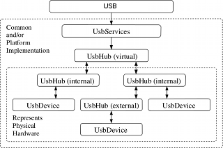
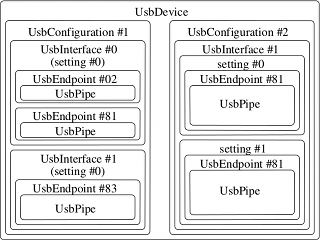

# javax-usb

A Java library to access USB devices.

# About

This is a (unofficial, revised, updated and extended) reference implementation of
the **JSR80** specification. JSR80 is the Java Specification Request API document.

-------|-----------
Name | javax-usb
Description | JSR80 Java USB API and Implementation.

# Background

JSR80 is (essentially) a concept and implementation strategy for communications
with Universal Serial Bus (USB) devices.
This project implements JSR80, which was written for USB 1.1, and extends it to
support features introduced in the USB 2.0 and USB 3.1 specifications (which are not
in JSR80).

This project was not created from whole cloth. Rather, it includes rewritten,
consolidated, updated and improved code forked from, rewritten, based upon and/or
inspired by the following projects. These existing project are stitched together
with a significant amount of new code to support new features and real-world use.
This project builds upon, consolidates and extends:

Project|Description
-------|-----------
javax-usb | The base Java API developed against the JSR80 concept document. This contains a set of Java Interface classes.
javax-usb-ri | A basic reference implementation of the javax-usb API. This contains a set of abstract, and some base, classes that implement the logic described in JSR80.
javax-usb-ri-linux | An extension of the based javax-usb-ri, with operating system-specific implementations for Linux.
usb4java | Another extension of the javax-usb-ri _plus_ a JNI-based interface to the de-facto USB standard library libusb (v 1.0.x).

# License

The code in this library stems from several projects, each with its own inherited
copyright and license. Check the header of the particular .java file of interest
for details.

* javax-usb : Apache 2.0
  * javax-usb-ri : Apache 2.0
  * javax-usb-ri-linux : Apache 2.0
* usb4java : GNU Lesser General Public License
* All others : Apache 2.0 or GNU General Public License

# Theory of Operation

This API implements (and extends) the javax-usb (JSR-80) standard. This API is object-oriented,
event-driven and uses exceptions for error-handling instead of negative return values
like the low-level (libusb) system API.

Nevertheless, the JSR80 specification, and consequently this implementation, provide _low-level_
access to the USB computer subsystem: basic read, write and control.

Typically you will build upon these low-level system capabilities to write a
more type-specific library (i.e. a driver) for your particular hardware.
A device driver basically defines and translates the bits and bytes accepted
by or produced from your device into user-friendly get- and set- methods.
See, for example, the FTDI UART USB driver library __lib-usb-ftdi__.

To summarize:

* This library (javax.usb) provides low-level (read, write, control) access
to the USB subsystem on your computer.
* You can use the capabilities of this library to build a device driver for your particular hardware.
* You then use your device driver to access the hardware.

To use this USB utility first get a list of all devices. Write a interface class
to read data from and write data to your device.

# Getting started

The javax.usb entry point is the **UsbHostManager** class, which includes a number of static
methods to query and access devices attached to your computer.

USB devices are managed in a tree, which is comprised of **hubs** and **devices**.
Hubs are a type of device with one or more **ports**. Devices connect to and
communicate via a port on a hub, which itself may connect to a port on another
(parent) hub, thus creating a tree.

The javax.usb API closely matches the physical device topology, except that
the root of the USB tree is a virtual USB hub created by the operating system and
configured (by the operating system) with one or more USB ports, each matching a
physical USB port on the host computer. The root usb hub is called just that: "Root USB Hub".

For example, a computer having two physical USB ports will therefore have the
following (default) configuration, created automatically by the operating system:

* ROOT
  * Port 1
  * Port 2

The ROOT hub is accessed via the **UsbHostManager** utility class as follows:

    public void getRootHub() throws UsbException {
      IUsbHub rootHub = UsbHostManager.getRootUsbHub();
      ...
   }

## Event Listener

You may listen for USB events (i.e. connect and disconnect) through the
**USBServices** interface, which is also available via the **USB** utility
class:

    public void getRootHub() throws UsbException {
      IUsbServices services = UsbHostManager.getUsbServices();
      services.addUsbServicesListener( ...
    ...
   }

## Data Pipes

A USB device is accessed by reading and/or writing to a **pipe**, which itself is
wrapped within an endpoint, wrapped within a interface, wrapped within a configuration.
In a typical configuration the device specification will identify which pipe to
use and how to access it.

The javax.usb API closely matches this logical hierarchy.

## System Configuration

Under GNU/Linux systems (and specifically under Debian-family oeprating systems),
regular users cannot directly access USB devices by default.
The system must be configured to allow such access

This is done by updating the **udev** subsystem configuration, adding rules to
the /etc/udev/rules.d directory that allow the Java user to access
(i.e. control, read and write) a USB device.

See the udev configuration file [51-android.rules](docs/config/51-android.rules)
for an example of how this is done on the Android operating system.

# References

* [JSR80](docs/jsr80.pdf)
* [USB 2.0](docs/USB 2.0.pdf)
* [USB 3.1-r1.0](docs/USB 3.1-r1.0.pdf)
* [USB 3.1 SuperSpeed Inter-Chip Supplement](docs/USB 3.1 SuperSpeed Inter-Chip Supplement.pdf)

# Links

* [javax.usb](http://javax-usb.sourceforge.net/) is the official development site of the Java Specification Request 80 (JSR80).
* [libusb](http://libusb.info/) is a C library that provides generic access to USB devices.
* [usb4java](http://usb4java.org/) is a Java library to access USB devices.
* 

